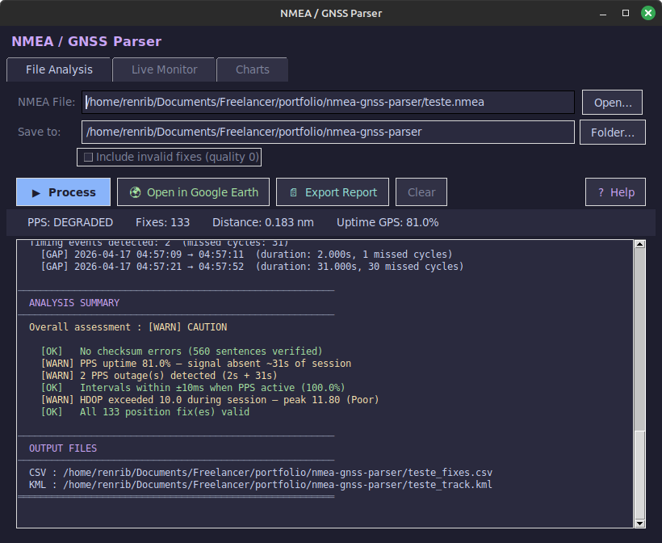
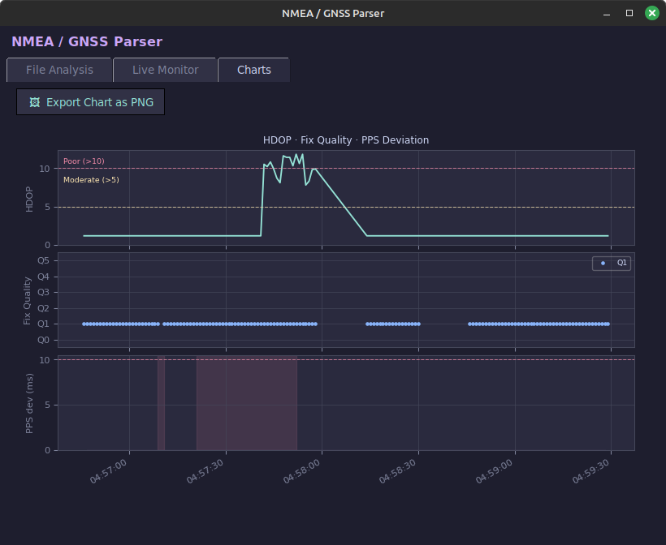
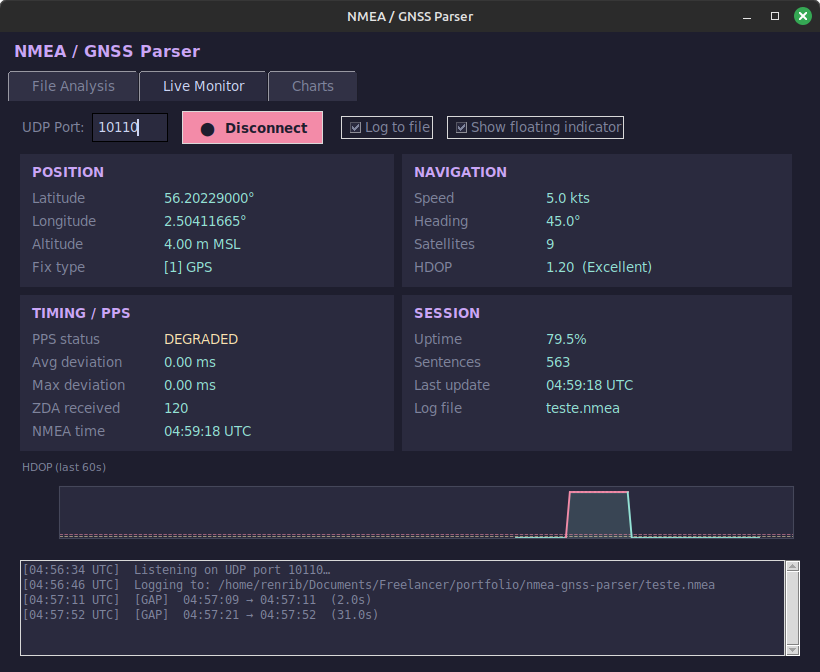
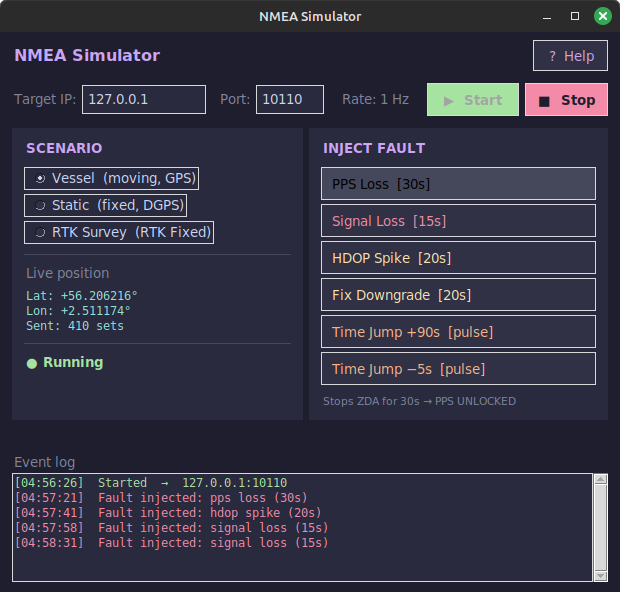

# NMEA/GNSS Parser

A professional NMEA 0183 log analyser and live monitor built in Python, designed for **marine, offshore, and survey applications**.

Supports post-processing of recorded logs and real-time monitoring over a serial/TCP port — with PPS timing analysis, signal quality charts, and Google Earth export.

---

## Features

### File Analysis
- Parses **GGA, RMC, VTG, GSA, ZDA** sentences with full checksum validation
- Fix quality breakdown: GPS, DGPS, RTK Fixed / Float
- HDOP quality assessment (Excellent / Good / Moderate / Poor)
- Distance (nautical miles & km), average/max speed, heading
- **PPS timing analysis** from ZDA 1 Hz stream: interval quality, forward/backward jumps, gap detection, uptime percentage — classified as LOCKED / DEGRADED / UNLOCKED
- **Analysis Summary** at report end: automatic PASS / CAUTION / ATTENTION flags for checksum errors, PPS uptime, timing jumps, HDOP thresholds, and fix validity
- Exports **CSV** (all fix data) and **KML** (track + waypoints for Google Earth)
- **Export Report** as plain-text `.txt`

### Charts (post-processing)
- HDOP over time with threshold reference lines
- Fix quality timeline (colour-coded by quality code)
- ZDA interval deviation — visual PPS jitter plot
- Export charts as PNG

### Live Monitor
- Connect to any serial or TCP source streaming NMEA sentences
- Live position, speed, heading, altitude, satellites, HDOP
- Real-time HDOP mini-chart (rolling 60-fix window)
- PPS lock status inferred from ZDA 1 Hz cadence
- Signal loss detection from GGA quality field
- Timing event log: gaps, forward/backward jumps flagged as they occur

### Floating Indicator
- Always-on-top compact overlay showing **PPS** and **SIG** status
- Drag to reposition, ×-close button
- Works on multi-monitor setups

### Simulator
- Generates realistic NMEA streams in real time (1 Hz) over UDP
- Three scenarios: **Vessel (moving, GPS)**, **Static (fixed, DGPS)**, **RTK Survey (RTK Fixed)**
- Fault injection panel:
  - **PPS Loss** — stops ZDA for 30s, triggering PPS UNLOCKED
  - **Signal Loss** — sends GGA quality=0 for 15s
  - **HDOP Spike** — injects degraded geometry for 20s
  - **Fix Downgrade** — drops fix quality for 20s
  - **Time Jump +90s / −5s** — pulse forward/backward timestamp anomaly
- Event log shows each injected fault with timestamp
- Designed to validate the Live Monitor and file analysis under real-world failure conditions

---

## Screenshots

> *GUI — File Analysis tab*



> *GUI — Charts tab*



> *GUI — Live Monitor tab*



> *NMEA Simulator — fault injection panel*



---

## Requirements

```
Python 3.10+
tkinter      (usually bundled with Python)
matplotlib   >= 3.7
```

Install dependencies:

```bash
pip install -r requirements.txt
```

---

## Usage

### GUI

```bash
python gui.py
# or
bash launch.sh
```

### Simulator (separate window)

```bash
python simulator.py
# or
bash launch_simulator.sh
```

### CLI (parser only, no GUI)

```bash
python nmea_parser.py survey.nmea

# Custom output directory
python nmea_parser.py survey.nmea --output ./results

# Include invalid fixes (quality=0) in output
python nmea_parser.py survey.nmea --include-invalid
```

---

## Output Files

| File | Description |
|------|-------------|
| `<name>_fixes.csv` | All fixes with coordinates, quality, HDOP, speed, heading |
| `<name>_track.kml` | Track + waypoints, opens in Google Earth |
| `<name>_report.txt` | Full text report (via Export Report button) |

---

## Project Structure

```
nmea-gnss-parser/
├── gui.py            # Main GUI application (tkinter)
├── nmea_parser.py    # Core parser, timing analysis, KML/CSV export
├── simulator.py      # NMEA stream simulator with fault injection
├── launch.sh         # Shortcut to launch GUI
├── launch_simulator.sh
├── requirements.txt
└── samples/          # Sample NMEA log files
```

---

## Author

**Renato Ribeiro**  
Computer Engineer | Electronics Technician | Senior Offshore Surveyor  
10+ years of subsea positioning and sensor integration experience.  
[LinkedIn](https://linkedin.com/in/renatoribeiro32854870)
